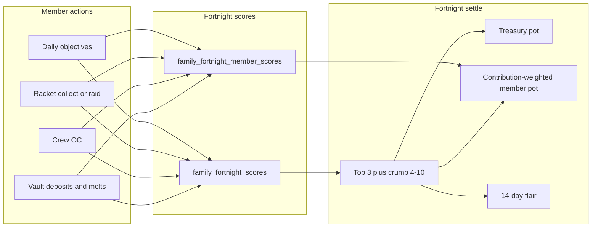

---
name: Family Fortnight Endgame
overview: "Design and phased build plan for post-P5 endgame: ship a Family Fortnight Leaderboard (2 London weeks), then later add seasonal Influence/empire seats. Nothing is implemented until you approve."
todos:
  - id: p1-scoring
    content: "Phase 1: family_fortnight.py + score/penalty hooks + rotating underperform vices (8h UTC)"
    status: pending
  - id: p1-settle
    content: "Phase 1: fortnight London settle worker, treasury + contribution splits, flair, idempotent payouts"
    status: pending
  - id: p1-ui
    content: "Phase 1: API + Leaderboard Families tab + Family page contribution widget"
    status: pending
  - id: p1-ship
    content: "Phase 1: update log + Desktop Mongo/files backup + git tag; dry-run; easy revert path"
    status: pending
  - id: p2-later
    content: "Phase 2 (later): seasonal influence + empire seats — design only until Phase 1 ships"
    status: pending
isProject: false
---

# Family Fortnight + Endgame Plan (report only — no build yet)

## Scope lock

| Phase | What | When |
|---|---|---|
| **Phase 1** | Family Fortnight Leaderboard (2-week score, top 3 payouts, member splits, UI) | Build after you approve |
| **Phase 2** | Seasonal Influence + empire seat sinks | Design only now; separate build later |
| **Out of scope** | New P6+ prestige, map/district grid, wiping casinos/properties each season | Not doing |

Default: **implement Phase 1 only** when you say go. Phase 2 stays a follow-up doc.

---

## Phase 1 — Family Fortnight Leaderboard

### Goal
Every **2 London weeks**, families compete on a shared **Family Power** score. Top 3 get treasury + contribution-weighted member rewards + short-lived flair. Idle / low-effort members take **minus points** when rotating underperform vices are active. Freeloaders do not take the member pot.

### Period timing (fortnight — not weekly)

- Period = **two consecutive London game weeks**: Monday 00:00 Europe/London → Monday +14 days
- Build on [`backend/utils/game_timezone.py`](backend/utils/game_timezone.py) `game_week_range_utc` — e.g. `period_id = f"{week_id_a}_{week_id_b}"` or epoch-fortnight index aligned to a fixed epoch Monday
- Settle after fortnight ends (same payout pattern as [`backend/routers/game/leaderboard.py`](backend/routers/game/leaderboard.py), but **every 2 weeks**)
- UI label: **Fortnight (UK time)** — e.g. "Mon 1 Sep – Sun 14 Sep"

Family dailies stay **UTC midnight**; fortnight score aggregates those into the London fortnight bucket.

### Scoring (Family Power)

Each family accumulates `period_score` for the current fortnight. Members also get `personal_score` used only for **split weight**. Track raw counters too (melt bullets to family, deposits, collects) for underperform checks.

| Source | Points | Notes |
|---|---|---|
| Family daily objective progress | 1 per unit of progress toward that day’s target | Hook existing `family_daily_progress` |
| Racket collect | +25 per collect | Cap **10 collects / member / day** |
| Racket raid (success) | +40 per raid | Cap **5 / member / day** |
| Crew OC complete | +150 per OC | Per participating member |
| Vault deposit (cash) | +1 per $100k deposited | Soft-cap **+500 score / member / day** from deposits |
| Vault deposit (points) | +1 per 10 points deposited | Soft-cap **+200 / member / day** |
| Garage melt → treasury | +1 per 2k bullets melted to treasury | **No daily cap** on +score |

**No minus for convenience spends** (crime/GTA skip tokens, melt cooldown tokens, etc.).

### Penalties

Two layers:

1. **Always on** — severe betrayal.
2. **Rotating vices** — mostly **underperformance floors** ("did less than X for the family today") plus a few drain actions; **2–3 active**, change during the day.

#### Always-on

| Action | Score hit | Notes |
|---|---|---|
| **Leave during active war / truce** | **−500 personal**, **−250 family** | Stacks with `war_rat` |
| **Quick Trade sell crew** | **−2000 personal**, **−1000 family** | Don lists family |

#### Rotating vice pool (pick 2–3 active)

Underperform vices settle at **end of UTC day** for members who **logged in** that day (offline = no hit). Drain vices fire on the action.

| Vice id | Trigger (when active) | Score hit | Notes |
|---|---|---|---|
| `low_melt` | Melted **less than 1,000** bullets **to family treasury** that UTC day | **−100 personal** | Your example; threshold tunable |
| `low_deposit` | Deposited **less than $2,500,000,000** cash to vault that UTC day | **−80 personal** | Skip if joined family less than 24h ago |
| `low_daily` | **Less than 25%** progress on family daily while ≥3 others completed | **−80 personal** | Logged-in only |
| `no_racket` | 0 racket collects that UTC day while family has ≥1 unlocked racket (not at war) | **−50 personal** | Soft floor |
| `no_oc` | 0 Crew OC participates that UTC day while crew ran ≥1 OC | **−60 personal** | Logged-in only |
| `low_raid` | 0 successful racket raids that day while family ran ≥3 raids total | **−40 personal** | Optional pressure |
| `vault_cash` | Vault cash withdraw | −1 / $100k; personal 100% / family 50%; **net** vs period deposits | Officers |
| `vault_bullets` | Vault bullet withdraw | −1 / 2k bullets; same 100/50 | Officers |
| `melt_pct_zero` | Set melt % to **0** | **−150 personal**, **−75 family** once/day | Auto-zero from empty vault = no hit |
| `war_kick` | Kick during war | **−200 personal**, **−50 family** | Peacetime free |
| `dead_weight_war` | Dead more than 24h in war with 0 war kills | **−40 personal** / day after 24h | Soft |

**Floor:** scores cannot go below **0**.

#### How rotation works

- Clock: **UTC**.
- Day split into **3 windows** (~8h): `00–08`, `08–16`, `16–24` UTC.
- Each window hash-picks **2–3** vice ids (deterministic from `utc_date + window_index`).
- Prefer mixing **one underperform + one drain** when possible.
- UI: **“Active vices now”** (e.g. “Melt under 1k to family = −100”) + countdown to next swap.

Example: morning `low_melt` + `vault_cash` → afternoon `low_daily` + `no_racket` → evening `low_deposit` + `melt_pct_zero`.

#### Still ignore

Skip tokens, compound/safe (own money), perk buys, peacetime leave/kick, vault give/split, enemy raids, whole-crew idle (don’t mass-punish).

**Not in v1 positive scoring:** war kills, airport/armoury ticks (v1.1).

**Eligibility to place top 3:**
- Family has ≥ **3 distinct contributors** that fortnight with `personal_score > 0`
- Family not disbanded / empty

**Tie-break:** higher unique contributors → earlier last score event.

### Data model (new collections)

- `family_fortnight_scores` — `{ family_id, period_id, score, unique_contributors, updated_at }`
- `family_fortnight_member_scores` — `{ family_id, period_id, user_id, username, score, breakdown{}, counters{} }` (counters: melt_to_family, deposits, etc. per UTC day)
- `family_fortnight_payouts` — `{ period_id, paid_at, placements[...] }` (idempotent)

`period_id` spans two London `week_id`s.

### Payouts (proposed — tunable; sized for 2 weeks)

Roughly **1.5–2×** a single weekly pot so the fortnight feels worth it:

**1st place**
- Treasury: **$75,000,000** cash + **750** treasury points + **75** treasury loot pieces
- Member pot: **40,000** store points total, split by `personal_score / family_score`
- Status: **Crew of the Fortnight** flair **14 days** (members with ≥1% of family score)
- Perk: **+10% racket income for 72h**
- **Family profile background** (see asset spec below) — equipped on the winning family’s profile for **14 days** (or until next #1 overwrites). Same idea as player dossier themes; families currently only have notepad colour.
- **Member profile badge** (see badge spec below) — static PNG icon on each qualifying member’s **player profile** for **14 days** (next to name / badge row), not via the custom-badge JPEG uploader (that strips alpha).

**2nd place**
- Treasury: **$40,000,000** + **400** pts + **40** loot
- Member pot: **20,000** points split
- Silver fortnight badge **14 days**

**3rd place**
- Treasury: **$15,000,000** + **150** pts + **15** loot
- Member pot: **8,000** points split
- Bronze fortnight badge **14 days**

**4th–10th (crumb):** treasury only — **$3,000,000** each.

Skip member share under **0.1%** of family score (no spam mail).

Payout delivery:
- Treasury → family vault (vault log)
- Member points → balance + mail: “Your crew finished #N — you received X points”
- Idempotent on `period_id`

Config: `family_fortnight_payout` Mongo doc.

### Family winner background — asset spec (for ChatGPT / art)

Match player dossier themes exactly ([`public/images/profile-themes/README.md`](public/images/profile-themes/README.md)):

| Spec | Value |
|---|---|
| **Size** | **1024 × 931 px** (exact) |
| **Aspect** | ≈ 1.10 (width / height) — not 16:9, not 9:16 |
| **Format** | **JPEG** (q90–92) |
| **Folder (when we ship)** | e.g. `public/images/family-themes/crew-of-the-fortnight.jpg` |
| **Composition** | Keep focal subject in the **upper ~60%** — family name / UI will sit over the middle; lower band can be darker/emptier like player themes |
| **Fit** | Displayed full-width, height auto (same as profile `fit: width`) |

**ChatGPT prompt starter:**  
“Mafia family crest / empire dossier banner, cinematic, exactly 1024x931 pixels, aspect ratio 1.10, subject in upper 60%, darker empty lower band, no text, no watermark.”

**Art locked (user-supplied):** cemetery / loot / tommy-gun night scene — **1024×931 JPEG** verified. Source (Cursor assets):  
`assets/.../image-df1ab0b9-a05e-47f2-8b6e-1bdd3f42177a.jpg`  
On build: copy to `public/images/family-themes/crew-of-the-fortnight.jpg` and register as the #1 fortnight family theme.

**Code (Phase 1):** add `family_background_theme` (or reuse theme id) on family doc; render on [`src/pages/Game/FamilyProfilePage.js`](src/pages/Game/FamilyProfilePage.js) like [`src/pages/Account/Profile.js`](src/pages/Account/Profile.js) dossier theme img; auto-set on fortnight #1 settle; clear/replace next period.

### Crew of the Fortnight badge — asset spec (for ChatGPT)

Yes — **transparent background (PNG with alpha)** so it sits cleanly on any profile theme / notepad colour.

| Spec | Value |
|---|---|
| **Format** | **PNG with transparency** (not JPEG — JPEG has no alpha) |
| **Canvas size** | **256 × 256 px** (source); UI shows ~**28–32 px** on profile (same ballpark as custom badge display) |
| **Safe area** | Keep the icon inside the centre ~80%; don’t touch edges (avoids clip when rounded) |
| **Style** | Single clear emblem (crest / crown / lion / tommy cufflink) — reads at 32px; avoid tiny text |
| **Background** | Fully transparent — no grey checker, no solid plate |
| **Folder (when we ship)** | e.g. `public/images/family-badges/crew-of-the-fortnight.png` |

**Why not the Store “custom badge” pipeline:** that path resizes to max 96px and saves as **JPEG**, which **kills transparency**. Fortnight badge = static PNG URL + flag on user (`crew_of_fortnight_until` or badge id in `badges[]`).

**ChatGPT prompt starter:**  
“Flat game UI badge icon, 256x256 PNG, fully transparent background, no checkerboard, mafia crew of the fortnight emblem, gold and black, simple bold silhouette readable at 32 pixels, no text, no drop shadow bleed off canvas, centered with padding.”

**Art status:** Candidate crest received (lions / crown / fedora / tommy guns) — **1024×1024 JPEG with solid black background**. Looks right thematically, but **not shippable yet**: needs **PNG + true alpha** (no black plate). Ask ChatGPT to re-export same design on transparent background; optional simplify slightly so it reads at 32px. Until then, do not copy into `public/images/family-badges/`.

**Code:** on #1 settle, grant badge to contributing members (≥1% score); show on Profile header badge row + optional hover preview; expire after 14 days or on next period award.

### Member split formula

```
member_points = floor(member_pot * personal_score / family_score)
```

Remainder → treasury points.

### UI

- **Leaderboard** ([`src/pages/Game/Leaderboard.js`](src/pages/Game/Leaderboard.js)): tab **Families (Fortnight)** — top 10; last period winners
- **Family page / Command Center**: “This fortnight: rank #X · your share Y% · melt to family today Z/1000” + **Active vices** banner
- **Family profile**: last period badge
- Admin: scores + force-settle + vice re-roll

### Backend surface

- Util: `backend/utils/family_fortnight.py` — score/penalty, period id, vice windows, settle
- Hooks: daily progress, racket collect/raid, crew OC, vault deposit/withdraw, melt→treasury counters, melt %, leave/kick, QT sell ([`backend/routers/game/families.py`](backend/routers/game/families.py) + melt path)
- API: `GET /families/fortnight-leaderboard`, `GET /families/me/fortnight-contribution`, `GET /families/fortnight-vices`
- Worker: settle previous fortnight + daily underperform settle — **idempotent**
- **Kill-switch:** `family_fortnight_enabled` in config (hooks + worker respect it)

### Anti-abuse

- Soft-caps on +score for racket/deposits; **melts uncapped** on +score
- Underperform floors only hit **logged-in** members (and grace for new joiners under 24h on deposit/melt floors)
- Always-on + rotating vices (see above)
- ≥3 contributors to place top 3

### Explicitly not in Phase 1

- Seasonal influence wipe
- State-head / casino seat contest layer
- Permanent power % from fortnight wins (only short racket buff for #1)
- Equal split to all family members



---

## Phase 2 — Seasonal Influence + empire sinks (design only)

Build **after** Phase 1 is live and tuned. Align season with Game Pass monthly roll ([`backend/utils/game_pass_season.py`](backend/utils/game_pass_season.py) — 1st of month 00:00 Europe/London).

### Split tracks

| Keep forever | Reset each Game Pass season |
|---|---|
| P5 multipliers, personal properties, IB, weed | **Influence** score |
| Base casino / airport / armoury ownership | Seasonal titles, house-cut bonuses, crowns |

### Influence earn (draft)

Daily drip from holding casino / airport / armoury / state head; racket collect; war wins; on-time property upkeep. **Not** from raw crime RP.

### Influence sinks / seats

- State Head as capstone seat (exists today — add influence contest + seasonal cut)
- Optional “House Boss” seasonal flair on casino without wiping ownership
- Scaled upkeep + heat if holding many seats
- Season end: wipe influence + seasonal titles; pay cosmetics / pot from a corruption tax if added

### Phase 2 deliverables (later)

1. `influence` on users/families + earn from existing holdings
2. Seasonal titles on State Head + flair
3. Scaled upkeep / heat
4. Season close hook next to Game Pass roll

No map/district grid.

---

## Implementation order (Phase 1 when approved)

1. **Backup first** (see Backup / revert below) — before any live deploy
2. Config + collections + `family_fortnight.py` score increments + day counters
3. Wire hooks + underperform daily settle + rotating vices
4. Fortnight settle worker + mail/notif + flair + family theme equip
5. API + Leaderboard Families tab + Family page widget + theme art copy
6. **Update log** entry (+ FAQ if needed)
7. Dry-run with kill-switch off → enable when OK
8. Keep revert notes handy for 48h after ship

### Update log (required)

Add via usual flow ([`docs/UPDATE_LOG.md`](docs/UPDATE_LOG.md) + [`scripts/push-update-log-topic.bat`](scripts/push-update-log-topic.bat)):

- **Title:** Family Fortnight Leaderboard
- **Bullets (player-facing):** 2-week family power board; top 3 treasury + points split by contribution; #1 gets Crew of the Fortnight flair + family profile background; rotating challenges/penalties (e.g. melt enough bullets for the family); skip tokens not penalised
- Keep short — no internal vice ids

### Backup / revert (required before live)

**Before deploy**
1. [`scripts/backup-production-to-desktop.bat`](scripts/backup-production-to-desktop.bat) — Mongo → Desktop
2. [`scripts/backup-files-to-desktop.bat`](scripts/backup-files-to-desktop.bat) — project zip
3. Git tag on commit **before** feature: `pre-family-fortnight-YYYYMMDD`
4. Config kill-switch `family_fortnight_enabled: false` until dry-run passes (hooks/settle no-op when off)

**If something breaks**
1. Flip `family_fortnight_enabled: false` immediately
2. Redeploy previous git tag
3. If payouts already ran: undo script from last `family_fortnight_payouts` (reverse vault/points/theme/flair) — prefer that over full DB restore; Desktop mongo archive is the fallback
4. Update-log follow-up only if players saw a broken state

---

## Open for your approval (defaults already chosen above)

Confirm or adjust before build:

1. **Payout amounts** (fortnight-sized pots) — OK?
2. **72h +10% racket income for #1** — keep or drop?
3. **Underperform floors** — melt under 1k, deposit under $2.5B, low daily, no racket/OC — OK thresholds?
4. **Fortnight** (2 London weeks) — confirmed over weekly?
5. **Phase 2** — later, not this build?

No code until you approve this plan (and any number tweaks).
